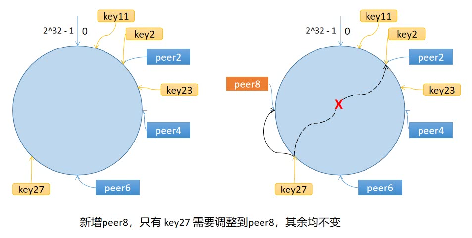

对于分布式缓存来说，当一个节点接收到请求，如果该节点并没有存储缓存值，那么它面临的难题是，从谁那获取数据？第一次随机选取了节点 1 ，节点 1 从数据源获取到数据的同时缓存该数据；那第二次，只有 1/10 的可能性再次选择节点 1, 有 9/10 的概率选择了其他节点，如果选择了其他节点，就意味着需要再一次从数据源获取数据。有什么办法，对于给定的 key，每一次都选择同一个节点呢？

一致性哈希算法将 key 映射到 2^32 的空间中，将这个数字首尾相连，形成一个环。

- 计算节点/机器(通常使用节点的名称、编号和 IP 地址)的哈希值，放置在环上。
- 计算 key 的哈希值，放置在环上，顺时针寻找到的第一个节点，就是应选取的节点/机器。



环上有 peer2，peer4，peer6 三个节点，`key11`，`key2`，`key27` 均映射到 peer2，`key23` 映射到 peer4。此时，如果新增节点/机器 peer8，假设它新增位置如图所示，那么只有 `key27` 从 peer2 调整到 peer8，其余的映射均没有发生改变。

如果服务器的节点过少，容易引起 key 的倾斜。为了解决这个问题，引入了虚拟节点的概念，一个真实节点对应多个虚拟节点。虚拟节点扩充了节点的数量，解决了节点较少的情况下数据容易倾斜的问题。而且代价非常小，只需要增加一个字典(map)维护真实节点与虚拟节点的映射关系即可。

```go
package consistenthash

import (
	"hash/crc32"
	"sort"
	"strconv"
)

// 允许用于替换成自定义的 Hash 函数，默认为 crc32.ChecksumIEEE 算法
type Hash func(data []byte) uint32

// Map contains all hashed keys
type Map struct {
	hash     Hash
	replicas int            // 虚拟节点倍数
	keys     []int          // 哈希环
	hashMap  map[int]string // 虚拟节点与真实节点的映射表
}

func New(replicas int, fn Hash) *Map {
	m := &Map{
		hash:     fn,
		replicas: replicas,
		hashMap:  make(map[int]string),
	}
	if m.hash == nil {
		m.hash = crc32.ChecksumIEEE
	}
	return m
}

// 添加真实节点
func (m *Map) Add(keys ...string) {
	for _, key := range keys {
		for i := 0; i < m.replicas; i++ {
			// 虚拟节点的名称是：strconv.Itoa(i) + key
			hash := int(m.hash([]byte(strconv.Itoa(i) + key)))
			m.keys = append(m.keys, hash)
			m.hashMap[hash] = key
		}
	}
	sort.Ints(m.keys)
}

// 在环上选择最近的节点
func (m *Map) Get(key string) string {
	if len(m.keys) == 0 {
		return ""
	}
	hash := int(m.hash([]byte(key)))
	idx := sort.Search(len(m.keys), func(i int) bool {
		return m.keys[i] >= hash
	})
	// 如果 idx == len(m.keys)，说明应选择 m.keys[0]
	return m.hashMap[m.keys[idx%len(m.keys)]]
}

```

